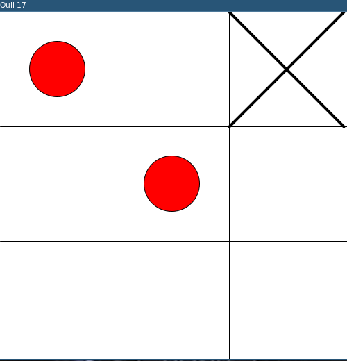

# Tic tac toe



Tic tac toe game with [quil](https://github.com/quil/quil).

## run
`lein play`

## repl
```
(use 'tic-tac-toe-clj.sketch)
;; hot reload
(use :reload 'tic-tac-toe-clj.core)
```

## TODO
- [X] win condition
  - [X] avoid game continuing after a player has won 
  - [ ] allow pressing a key to start a new match
  - [ ] detect and warn when game is a tie
  - [ ] win animation
- [ ] menu
- [X] status bar showing current player and time
- [ ] check if things work when changing dimensions
- [ ] play against computer?
- [ ] replay log: add commands to a log so that the game can be replayed or movements undo
- [ ] multiplayer?
